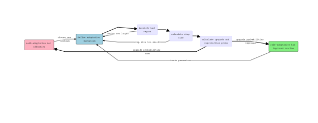

Below you can find two example diagrams based on my research on self-adaptive evolutionary algorithms.

## Path Diagram

Here is a path diagram depicting a cartoon of the logic/workflow used when proving an algorithm's effectiveness.



## Pre-graph

Here is a graph of the results we aimed to show, and oberved experimentally. The red line is a simple benchmark EA runtime, and the green is the runtime of a self-adaptive one.

```{r, echo=FALSE}
x = seq(10, 250)
y = x^1.5
poly = function(x, a) {
  return(x^a)
}

plot(x, y, type="n", ylab="expected runtime", xlab="problem length")
curve(poly(x, 1.5), col="red", type="l", add=T)
curve(100 + 5 * poly(x, 1), col="green", type="l", add=T)
```

