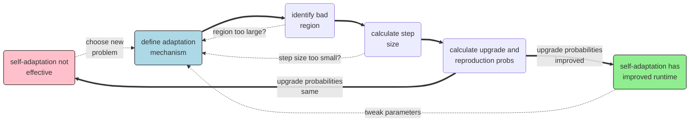

```mermaid
graph LR
Fail(self-adaptation not <br> effective) -.choose new <br> problem.-> A
Succ(self-adaptation has <br> improved runtime) -.tweak parameters.-> A
A(define adaptation <br> mechanism) ==> B(identify bad <br> region)
B -.region too large?.-> A
B ==> C(calculate step <br> size)
C -.step size too small?.-> A
C ==> D(calculate upgrade and <br> reproduction probs)
D ==upgrade probabilities <br> improved==> Succ
D ==upgrade probabilities <br> same==> Fail

style A fill:lightblue, stroke:black, stroke-width:1px
style Fail fill:pink, stroke:black, stroke-width:1px
style Succ fill:lightgreen, stroke:black, stroke-width:1px
```

