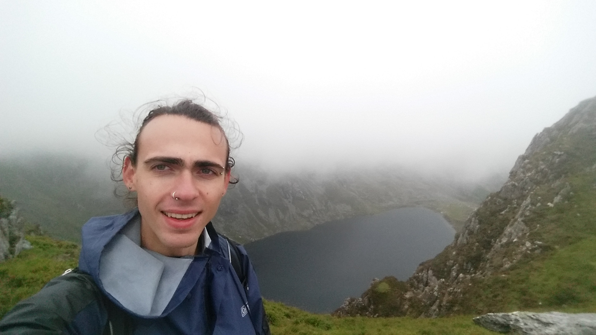

<body>
### Computational Biology
### Fall 2018    

### Brendan Case 
Email: Brendan.Case@uvm.edu   

## Table of contents    
* [08/29/2018 Homework 1: Setting up a webpage](#sec1)
* [09/05/2018 Homework 2: Typora diagrams](#sec2)
* [09/12/2018 Homework 3: Creating a Beamer Presentation](#sec3)
* [09/19/2018 Homework 4: Atomic Vectors and Regular Expression](#sec4)
* [09/26/2018 Homework 5: Using the Dplyr Package](#sec5)
* [10/03/2018 Homework 6: Plotting and Simulating Data](#sec6)
* [10/10/2018 Homework 7: Creating Fake Data Sets To Explore Hypotheses](#sec7)
* [10/17/2018 Homework 9: Looping Structures](#sec9)
* [10/24/2018 Homework 10: Randomization Tests](#sec10)
* [10/31/2018 Homework 11: Advanced ggplotting](#sec11)
* [12/06/2018 Final Presentation: The caret package](#secfin)

## Homework

[Homework 1](hw1/hw1.html)

[Homework 2](hw2/hw2.html)

[Homework 3 (Click to Download)](hw3/hw3.pdf)

[Homework 4](hw4/hw4.html)

[Homework 5](hw5/hw5.html)

[Homework 6](hw6/hw6.html)

[Homework 7](hw7/hw7.html)

[Homework 8](hw8/hw8.html)

[Homework 9](hw8/hw9.html)

[Homework 10](hw10/hw10.html)

[Homework 11](hw11/hw11.html)

[Final Presentation](final/carets_wine.html)

</body>
